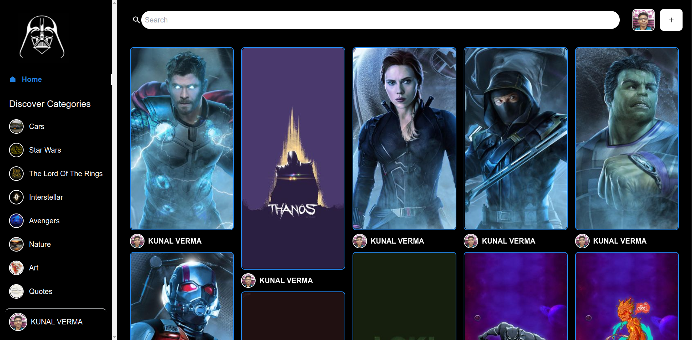

# Introduction

DarthVad is a social media image sharing platform that connects the fans of Star Wars, Avengers, The Lords of the Rings, Interstellar, etc.

## 

## Tech Stack

*  - Sanity.io is the platform for structured content. With Sanity.io you can manage your text, images, and other media with APIs.
*  - A JavaScript library to build user interfaces
*  - A utility-first CSS framework packed with classes that can be composed to build any design.

